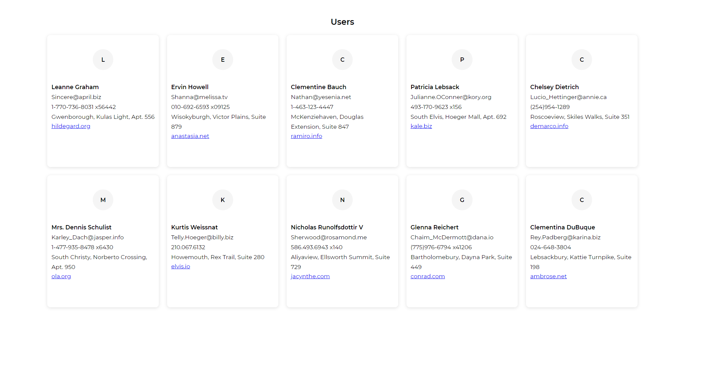

# Getting Started with Create React App

This project was bootstrapped with [Create React App](https://github.com/facebook/create-react-app).

# Users in a Food store
This is a React implementation for a users listing for a food store. It consumes apis from [rapidapi](https://rapidapi.com/shashwath-KR/api/fake-users7/) to demonstrate approaches with React context api and emotion-js styled components.




> Made with love by React, Typescript, Emotion Js, Rapid API

#### Steps to run locally
```
git clone https://github.com/robertkibet/cra-demo-food-ap.git
cd cra-demo-food-ap
yarn install
yarn start
```
voila!!! :tada:

--- 

:smile: :tada: find me on [twitter](https://twitter.com/realrobertkibet) :zap: